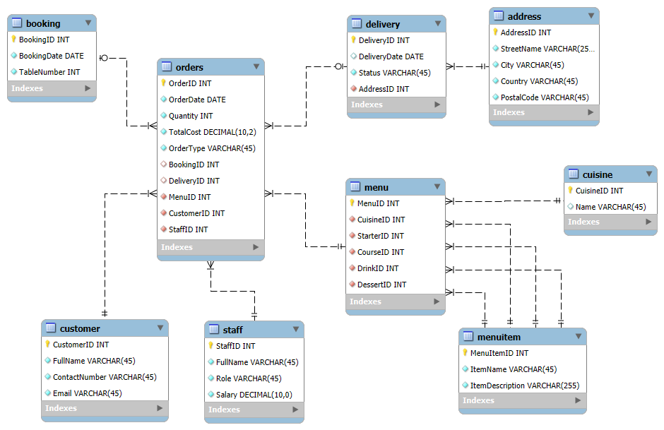

# db-capstone-project

This repository contains the capstone project for **Meta Database Engineer Professional Certificate**.

<br>


## Module 1 - Exercise: Create an ER diagram data model and implement it in MySQL

### Task 1: Data Model

Data Model File:  
[LittleLemonDM.mwb](./LittleLemonDM.mwb)

ER Diagram:  


### Task 2: Forward Engineer

Exported SQL:  
[LittleLemonDB.sql](./LittleLemonDB.sql)

### Task 3: Verification

```sql
SHOW DATABASES;
```

<br>


## Additional - Importing data

Use [load-data-into-db.ipynb](./data-ingestion/load-data-into-db.ipynb) to load partial data into the database.

<br>


## Module 2 - Exercise: Create a virtual table to summarize data

### Task 1: View `OrdersView`

```sql
CREATE VIEW OrdersView AS
SELECT OrderID, Quantity, TotalCost
FROM orders
WHERE Quantity > 2
;
```

### Task 2: Join Statement

```sql
SELECT customer.CustomerID, customer.FullName, orders.OrderID, orders.TotalCost, cuisine.Name AS MenuName, menuitem.ItemName AS CourseName
FROM orders
INNER JOIN customer ON orders.CustomerID = customer.CustomerID
INNER JOIN menu ON orders.MenuID = menu.MenuID
INNER JOIN cuisine ON cuisine.CuisineID = menu.CuisineID
INNER JOIN menuitem ON menuitem.MenuItemID = menu.CourseID
WHERE orders.TotalCost > 150
ORDER BY orders.TotalCost ASC
;
```

### Task 3: Subquery

```sql
SELECT DISTINCT cuisine.Name AS MenuName
FROM cuisine
INNER JOIN menu on menu.CuisineID = cuisine.CuisineID
WHERE menu.MenuID = ANY (
	SELECT orders.MenuID
    FROM orders
    WHERE orders.Quantity > 2
);
```

<br>


## Module 2 - Exercise: Create optimized queries to manage and analyze data

### Task 1: Stored Procedure `GetMaxQuantity`

```sql
DELIMITER //

CREATE PROCEDURE GetMaxQuantity()
BEGIN
	DECLARE maxQty INT;
	SELECT MAX(Quantity) INTO maxQty FROM orders;
	SELECT maxQty AS "Max Quantity in Order";
END //

DELIMITER ;
```
```sql
CALL GetMaxQuantity();
```

### Task 2: Prepared Statement `GetOrderDetail`

```sql
PREPARE GetOrderDetail FROM "
SELECT OrderID, Quantity, TotalCost
FROM orders
WHERE OrderID = ?
";
```
```sql
SET @id = 1;
EXECUTE GetOrderDetail USING @id;
```

### Task 3: Stored Procedure `CancelOrder`

```sql
DELIMITER //

CREATE PROCEDURE CancelOrder(IN id_to_delete INT)
BEGIN
	DECLARE order_count INT DEFAULT 0;

	SELECT COUNT(*) INTO order_count
    FROM orders
    WHERE OrderID = id_to_delete;

	IF order_count > 0 THEN
		DELETE FROM orders WHERE OrderID = id_to_delete;
		SELECT CONCAT("Order ", id_to_delete, " is cancelled") AS "Confirmation";
	ELSE
		SELECT CONCAT("Order ", id_to_delete, " does not exist") AS "Confirmation";
	END IF;
END //

DELIMITER ;
``` 
```sql
CALL CancelOrder(5);
```

<br>


## Module 2 - Exercise: Create SQL queries to check available bookings based on user input

### Task 1: Insert Statement

```sql
INSERT INTO bookings (BookingID, BookingDate, TableNumber, CustomerID)
VALUES
	(1, "2022-10-10", 5, 1),
	(2, "2022-11-12", 3, 3),
	(3, "2022-10-11", 2, 2),
	(4, "2022-10-12", 2, 1)
;
```

### Task 2: Stored Procedure `CheckBooking`

```sql
DELIMITER //

CREATE PROCEDURE CheckBooking(IN booking_date DATETIME, IN table_number INT)
BEGIN
	DECLARE table_count INT DEFAULT 0;

	SELECT COUNT(*) INTO table_count
    FROM booking
	WHERE BookingDate = booking_date AND TableNumber = table_number;

	IF table_count > 0 THEN
		SELECT CONCAT("Table ", table_number, " is already booked") AS "Booking status";
	ELSE
		SELECT CONCAT("Table ", table_number, " is not booked") AS "Booking status";
	END IF;
END //

DELIMITER ;
```
```sql
CALL CheckBooking("2022-11-12", 3);
```

### Task 3: Stored Procedure `AddValidBooking`

```sql
DELIMITER //

CREATE PROCEDURE AddValidBooking(IN booking_date DATETIME, IN table_number INT)
BEGIN
    DECLARE table_count INT DEFAULT 0;
    START TRANSACTION;
    
    SELECT COUNT(*) INTO table_count
    FROM booking
    WHERE BookingDate = booking_date AND TableNumber = table_number;

    IF table_count > 0 THEN
        ROLLBACK;
        SELECT CONCAT('Table ', table_number, ' is already booked - booking cancelled') AS "Booking status";
    ELSE
        INSERT INTO booking (BookingDate, TableNumber)
        VALUES (booking_date, table_number);
        COMMIT;
        SELECT 'Booking successful' AS "Booking status";
    END IF;
END//

DELIMITER ;
```
```sql
CALL AddValidBooking("2022-10-10", 5);
```

<br>


## Module 2 - Exercise: Create SQL queries to add and update bookings

### Task 1: Stored Procedure `AddBooking`

```sql
DELIMITER //

CREATE PROCEDURE AddBooking(IN booking_id INT, IN customer_id INT, IN booking_date DATETIME, IN table_number INT)
BEGIN
	INSERT INTO Bookings (BookingID, BookingDate, TableNumber, CustomerID)
    VALUES (booking_id, booking_date, table_number, customer_id);
    SELECT "New booking added" AS "Confirmation";
END //

DELIMITER ;
```
```sql
CALL AddBooking(9, 3, 4, "2022-12-30");
```

### Task 2: Stored Procedure `UpdateBooking`

```sql
DELIMITER //

CREATE PROCEDURE UpdateBooking(IN booking_id INT, IN booking_date DATETIME)
BEGIN
	UPDATE booking SET BookingDate = booking_date
	WHERE BookingID = booking_id;
	SELECT CONCAT("Booking ", booking_id, " updated") AS "Confirmation";
END //

DELIMITER ;
```
```sql
CALL UpdateBooking(9, "2022-12-17")
```

### Task 3: Stored Procedure `CancelBooking`

```sql
DELIMITER //

CREATE PROCEDURE CancelBooking (IN booking_id INT)
BEGIN
    DELETE FROM booking WHERE BookingID = booking_id;
    SELECT CONCAT("Booking ", booking_id, " cancelled") AS "Confirmation";
END //

DELIMITER ;
```
```sql
CALL CancelBooking(9);
```

---------

<br>


## Module 3 - Exercise: Set up the Tableau Workspace for data analysis

### Task 1 to 3: Tableau Data Ingestion

Tableau Workbook (for all tasks):  
[Meta Database Engineer Course 9 - Little Lemon.twbx](./Meta%20Database%20Engineer%20Course%209%20-%20Little%20Lemon.twbx)

<br>


## Module 3 - Exercise: Create interactive dashboard for sales and profits

### Task 1 to 5: Tableau Visualizations

Tableau Workbook (for all tasks):  
[Meta Database Engineer Course 8 - Little Lemon.twbx](./Meta%20Database%20Engineer%20Course%208%20-%20Little%20Lemon.twbx)

Tableau Public:  
[Customer sales](https://public.tableau.com/app/profile/philip.lee1073/viz/MetaDatabaseEngineerCourse8-LittleLemon/Customersales)  
[Profit chart](https://public.tableau.com/app/profile/philip.lee1073/viz/MetaDatabaseEngineerCourse8-LittleLemon/Profitchart)  
[Sales bubble chart](https://public.tableau.com/app/profile/philip.lee1073/viz/MetaDatabaseEngineerCourse8-LittleLemon/Salesbubblechart)  
[Cuisine sales and profits](https://public.tableau.com/app/profile/philip.lee1073/viz/MetaDatabaseEngineerCourse8-LittleLemon/Cuisinesalesandprofits)  
[Interactive sales dashboard](https://public.tableau.com/app/profile/philip.lee1073/viz/MetaDatabaseEngineerCourse8-LittleLemon/Interactivesalesdashboard)  

<br>


## Module 3 - Exercise: Add query functions

### Task 1 to 3: Python Client

Jupyter Notebook (for all tasks):  
[LittleLemonClient.ipynb](./LittleLemonClient.ipynb)